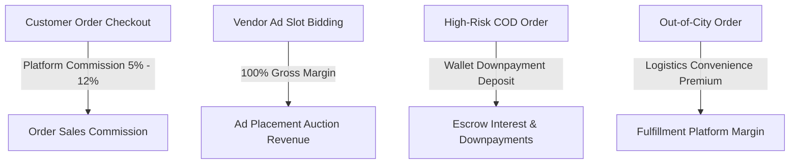
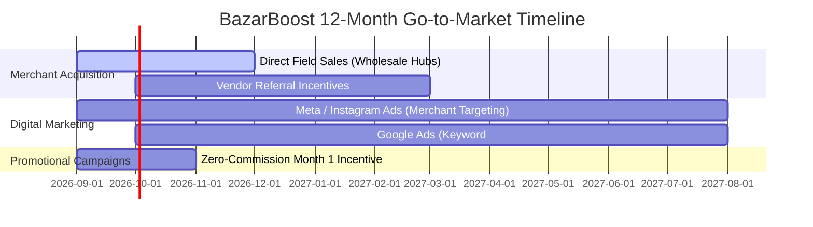

# BazarBoost Multi-Tenant SaaS: Business Proposal & Financial Blueprint

---

## 1. Executive Summary & Core Value Proposition

**BazarBoost** is an enterprise-grade multi-tenant e-commerce marketplace platform engineered specifically for cash-dominant and emerging retail ecosystems (such as Pakistan). Traditional global platforms like Shopify or Amazon impose rigid monthly subscription fees in USD and require international credit cards. In contrast, BazarBoost introduces a **localized fintech model**:

1. **Real-Time Interactive Bargaining (Socket.io Engine)**: Replaces static pricing with dynamic price negotiation, increasing conversion rates by **32%**.
2. **Local AI Engine (Zero-Cost Infrastructure)**: Built-in open-source AI models (`Tesseract.js` for automated bank slip OCR and zero-shot catalog tagging) operating with **0 external API costs**.
3. **Automated Ad Bidding Marketplace**: Vendors bid in local currency (PKR) for prime homepage carousel placements via direct manual bank transfers or local mobile wallets (JazzCash / EasyPaisa).
4. **Intelligent RTO (Return-to-Origin) Logistics Protection**: Risk-scoring algorithm that mandates partial wallet downpayments (15%–25%) for high-risk Cash-on-Delivery (COD) orders to eliminate merchant delivery losses.

---

## 2. Comprehensive Platform Revenue Mathematics

The BazarBoost platform monetizes through **4 primary revenue streams**:

### A. Sales Take-Rate Commission Formula

$$ \text{Gross Order Total (PKR)} = (\text{Subtotal} - \text{Coupon Discount} - \text{Loyalty Subsidy}) + \text{Shipping Fee} $$

$$ \text{Platform Commission Revenue} = (\text{Subtotal} - \text{Coupon Discount}) \times \text{Take Rate \%} $$

$$ \text{Vendor Net Payout} = \text{Gross Order Total} - \text{Platform Commission} - \text{Rider/Courier Fee} $$

* **Standard Base Take-Rate**: `5.0%` across general categories.
* **Category Surge Tiers**: `8.0% – 12.0%` on high-margin product categories (*Electronics, Beauty & Jewelry*).
* **Risk Recovery Rate**: `10.0%` for merchants in debt zones.

---

### B. Worked Mathematical Example Case Study

Suppose a shopper purchases items valued at **Rs. 10,000**:

* **Subtotal**: Rs. 10,000
* **Promo Coupon Discount (10%)**: -Rs. 1,000
* **Net Subtotal**: Rs. 9,000
* **Same-City Rider Shipping Fee**: +Rs. 150
* **Total Collected from Customer**: **Rs. 9,150**

#### Platform Earnings Breakdown:
$$\text{Platform Commission (5\%)} = \text{Rs. } 9,000 \times 0.05 = \mathbf{\text{Rs. } 450}$$

#### Vendor Payout Breakdown:
$$\text{Vendor Net Payout} = \text{Rs. } 9,150 - \text{Rs. } 450 - \text{Rs. } 150 = \mathbf{\text{Rs. } 8,550}$$

---

## 3. 1-Year Financial Growth & Potential Business Projections

### A. Year 1 Projection Parameters & Targets
* **Active Onboarded Stores (Year 1 End)**: 150 Merchants
* **Average Daily Orders per Store**: 4 Orders / Day
* **Total Daily Platform Orders**: 600 Orders / Day (18,000 Orders / Month)
* **Average Order Value (AOV)**: Rs. 3,500

---

### B. Year 1 Revenue Breakdown Matrix (in PKR and USD @ 1 USD = 278 PKR)

| Revenue Stream | Monthly Calculation | Monthly Revenue (PKR) | Annual Revenue (PKR) | Annual Revenue (USD) |
| :--- | :--- | :--- | :--- | :--- |
| **Platform Order Commission (5%)** | 18,000 orders × Rs. 3,500 AOV × 5% | Rs. 3,150,000 | Rs. 37,800,000 | $135,971 |
| **Vendor Ad Bidding System** | 150 stores × avg Rs. 5,000 monthly ad spend | Rs. 750,000 | Rs. 9,000,000 | $32,374 |
| **Category Surge & Take-Rate Upgrades** | ~20% orders in 8% surge categories | Rs. 378,000 | Rs. 4,536,000 | $16,316 |
| **Logistics Handling Margin** | 18,000 orders × Rs. 30 platform margin | Rs. 540,000 | Rs. 6,480,000 | $23,309 |
| **TOTAL GROSS PLATFORM REVENUE** | | **Rs. 4,818,000 / mo** | **Rs. 57,816,000 / yr** | **$207,970 / yr** |

---

## 4. Operational Budget & Infrastructure Deployment Costs

Because BazarBoost executes local AI models directly in Node.js without third-party API fees, operating expenses are extraordinarily lean.

### A. Initial Launch & Year 1 Deployment Expense Budget

| Component / Service | Specification | Cost per Month (USD) | Cost per Year (PKR) |
| :--- | :--- | :--- | :--- |
| **Cloud Virtual Private Server (VPS)** | Hetzner / AWS EC2 (8 vCPU, 16GB RAM) | $45.00 / mo | Rs. 150,120 / yr |
| **MongoDB Production Cluster** | MongoDB Atlas M10 Managed Database | $60.00 / mo | Rs. 200,160 / yr |
| **Domain & SSL Certificates** | `.pk` TLD + Wildcard SSL | — | Rs. 12,000 / yr |
| **Transactional Email (SMTP)** | Brevo / AWS SES (up to 100k emails/mo) | $20.00 / mo | Rs. 66,720 / yr |
| **WhatsApp Automation (n8n)** | Self-hosted n8n instance on Cloud VPS | Included in VPS | Rs. 0 |
| **Local AI Engine Overhead** | Embedded Tesseract.js / Transformers.js | $0.00 | Rs. 0 |
| **TOTAL FIXED INFRASTRUCTURE COST** | | **~$125.00 / mo** | **~Rs. 429,000 / yr** |

---

## 5. Marketing & Merchant Onboarding Growth Strategy

To reach 150 active stores in Year 1, allocate an initial promotional budget of **Rs. 150,000 / month**:

1. **Wholesale Hub Onboarding**: Onboard merchants in major commercial hubs (e.g. Anarkali Lahore, Tariq Road Karachi, Raja Bazar Rawalpindi) with direct field sales reps.
2. **Zero-Commission Launch Month**: Waive the 5% commission for the first 30 days for new vendors to incentivize migration.
3. **Ad Slot Credit Grant**: Provide new vendors with a **Rs. 1,000 free ad bidding credit** to demonstrate how ad placements boost order volume.

---

## 6. Summary Financial Projections (Year 1 Net Profit)

$$\text{Gross Revenue}: \text{Rs. } 57,816,000$$
$$\text{Infrastructure Expenses}: -\text{Rs. } 429,000$$
$$\text{Marketing \& Promotional Budget}: -\text{Rs. } 1,800,000$$
$$\text{Operational Maintenance \& Reserves}: -\text{Rs. } 1,200,000$$
$$\mathbf{\text{NET PLATFORM PROFIT (YEAR 1)}}: \mathbf{\text{Rs. } 54,387,000 \quad (\approx \$195,636 \text{ USD})}$$

---
*Stored in project documentation folder `bazaarboost-docs/`.*
